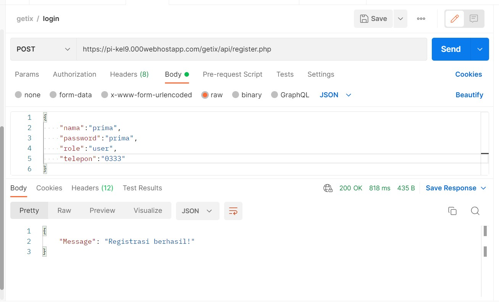
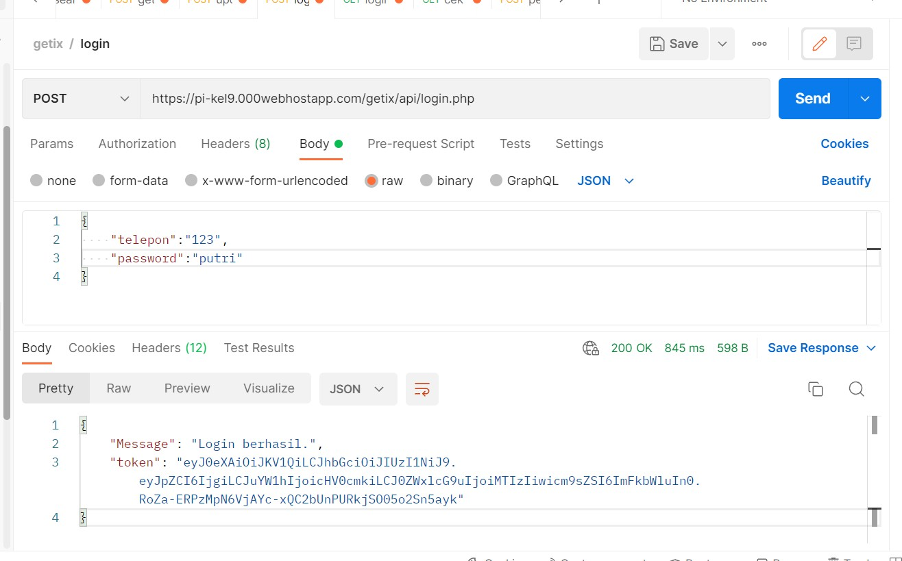
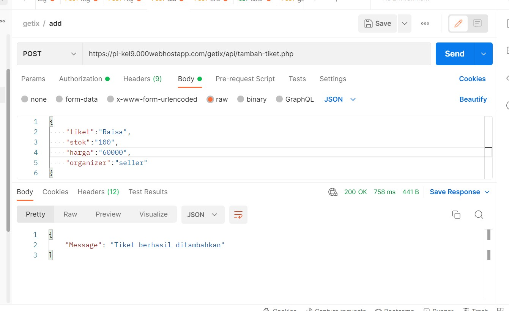
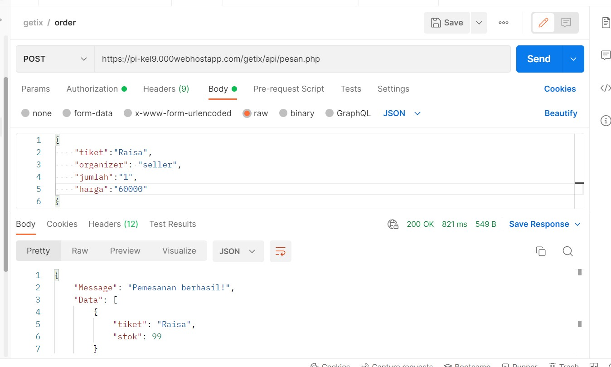
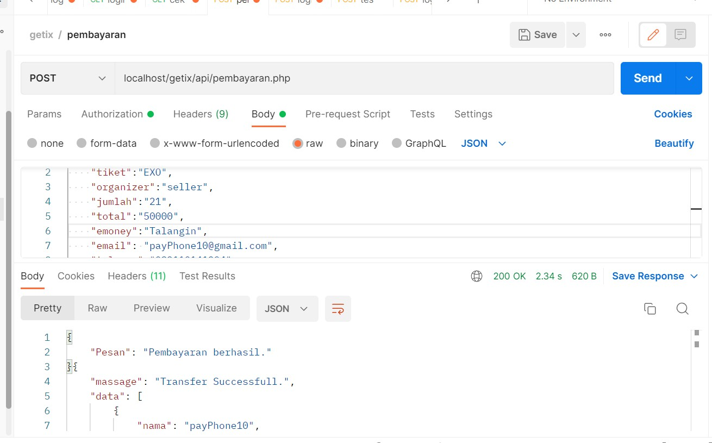
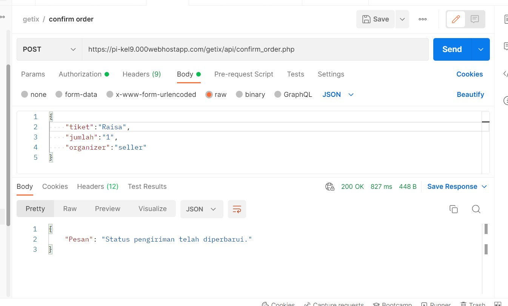

# GeTix REST API

## Kelompok 09
1. Asima Prima Yohana - 5027201009
2. Brilianti Puspita S ari - 5027201070
3. Adinda Putri Audyna - 5027201073

## Register

### Method
`post`

### endpoint
`.../api/register.php`

### URL
`https://pi-kel9.000webhostapp.com/getix/api/register.php`

### auth
tidak ada 

### parameter 
{
"nama": "puspita",
"password": "puspita",
"role":"admin",
"telepon":"0888"
}

### output postman

## Login

### Method
`post`

### endpoint
`.../api/login.php`

### URL
`https://pi-kel9.000webhostapp.com/getix/api/login.php`

### auth
tidak ada 

### parameter 
{
    "telepon":"0999",
    "password":"yohana"
}

### output postman

## Tambah Tiket

### Method
`post`

### endpoint
`.../api/tambah-tiket.php`

### URL
`https://pi-kel9.000webhostapp.com/getix/api/tambah-tiket.php`

### parameter 
{
    "tiket":"Tulus",
    "stok":"100",
    "harga":"60000",
    "organizer":"seller"
}

### auth 
token

### output postman

## Pesan Tiket

### Method
`post`

### endpoint
`.../api/pesan.php`

### URL
`https://pi-kel9.000webhostapp.com/getix/api/pesan.php`

### parameter 
{
    "tiket":"Tulus",
    "organizer": "seller",
    "jumlah":"5",
    "harga":"60000"
}

### auth 
token

### output postman

## Pembayaran

### Method
`post`

### endpoint
`.../api/pembayaran.php`

### URL
`https://pi-kel9.000webhostapp.com/getix/api/pembayaran.php`

### parameter 
{
    "tiket":"Tulus",
    "organizer":"seller",
    "jumlah":"5",
    "total":"60000",
    "emoney":"talangin",
    "email": "payPhone10@gmail.com",
    "telepon":"082110141294",
    "password":"payPhone10",
    "username":"payPhone10"
}

### auth 
token

### output postman

## Konfirmasi Order

### Method
`post`

### endpoint
`.../api/confirm_order.php`

### URL
`https://pi-kel9.000webhostapp.com/getix/api/confirm_order.php`

### auth
token

### parameter 
{
    "tiket":"Raisa",
    "jumlah":"1",
    "organizer":"seller"
}

### output postman

## Acc Order

### Method
`post`

### endpoint
`.../api/users/finish_order.php`

### URL
`https://pi-kel9.000webhostapp.com/getix/api/finish_order.php`

### auth
token

### parameter 
{
    "tiket":"Raisa",
    "pembeli":"yohana",
    "jumlah":"1",
    "total":"60000",
    "emoney":"talangin",
    "email":"payPhone10@gmail.com",
    "telepon":"082110141294",
    "password":"payPhone10",
    "username":"payPhone10"

}

### output postman
![image.png]({acc produk.png}]

